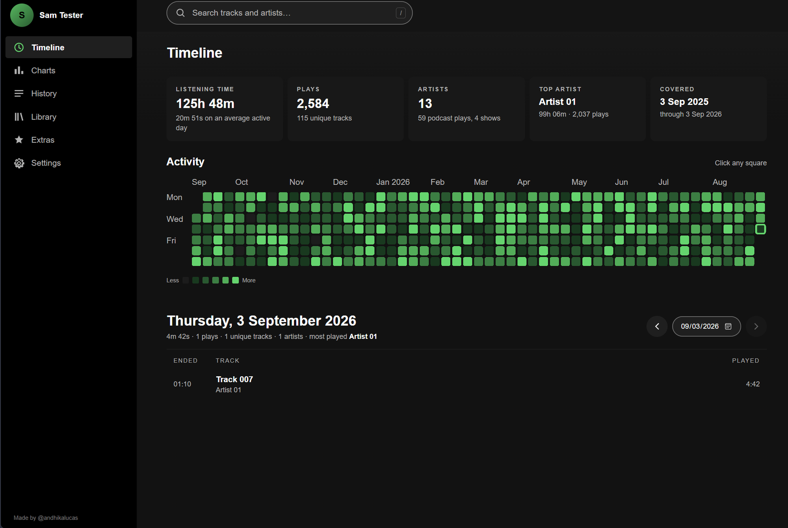

# Spotify Stats Visualizer

A visualizer for your exported Spotify account data that runs on your browser locally. 
Built with the same design system style of Spotify.

## Features

- **Timeline**: an activity heatmap across your listening history
- **Charts**: top artists and top tracks by listening time or play count,
  over Week / Month / Quarter / Year / All time or a custom range
- **History**: every play in one searchable list
- **Library**: saved tracks, albums, followed artists, playlists, shows,
  episodes, and hidden artists
- **Extras**: Wrapped, Sound Capsule, podcasts, search queries, follows and
  messages, ad inferences, and a summary of what your upload contained.
- **Settings**: time zone, content type, and loading another export or
  clearing the current one.

Keyboard: `/` jumps to search, `1`-`6` switch views, and the arrow keys step
between days on the Timeline.

## How to use it

1. **Get your data.** Go to [Spotify's privacy
   page](https://www.spotify.com/id-id/account/privacy/) and request
   **Account data**. Spotify emails you a download link within a few days.
   This is the basic export, not the extended streaming history.
2. **Open the site and drop in your export.** Use the `.zip` as it arrives,
   or the unzipped folder. Only `StreamingHistory_music_*.json` is required;
   every other file is optional, and anything missing just means that
   section isn't shown.
3. **Keep adding to it.** The account export only covers about the last
   year. Request a new one later and choose **Add or replace export** in
   Settings: plays are combined by date, and where two exports overlap the
   newer one is kept (it also replaces the library, playlists and Wrapped).
   Adding an older export only fills in history the newer one doesn't
   reach. Choose **Replace** instead to start over with just that upload.

## Notes

- **Play records carry no album field.** Album names are joined from
  playlists and saved tracks, so they only cover part of a library, which
  is why there's no Top Albums chart.
- **Timestamps are UTC and mark when a track *ended*.** Set your time zone
  in Settings so calendar days line up.
- **Plays under 30 seconds aren't counted**, matching Spotify's own
  threshold for what counts as a stream.
